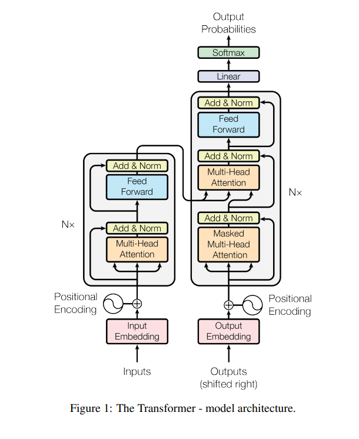

# Attention is all you need

## Abstract

这段话主要在介绍一种新的神经网络架构——Transformer。以下是对这段话的中文解释：

当前主流的序列转换模型基于复杂的循环神经网络（RNN）或卷积神经网络（CNN），这些模型包含编码器和解码器两个部分。性能最好的模型还通过注意力机制来连接编码器和解码器。我们提出了一种新的简单网络架构——Transformer，它完全基于注意力机制，完全不使用循环和卷积操作。在两个机器翻译任务上的实验显示，这些模型在质量上更胜一筹，同时更易于并行处理，并且训练时间大大减少。我们的模型在WMT 2014英德翻译任务上达到了28.4的BLEU分数，比现有的最佳结果（包括集成模型）提高了超过2个BLEU分。在WMT 2014英法翻译任务上，我们的模型在使用八块GPU训练3.5天后，建立了一个新的单一模型最佳BLEU分数41.8，这只是文献中最佳模型训练成本的一小部分。我们还展示了Transformer能够很好地泛化到其他任务，通过将其成功应用于英语成分句法分析任务，无论是在大量还是有限的训练数据上。

## 1. Introduction

循环神经网络（RNN），特别是长短期记忆网络（LSTM）和门控循环网络（GRU），已经被认定为序列建模和序列转换问题中的最先进技术。很多研究工作一直在持续地推动循环语言模型和编码器-解码器架构的发展。

循环模型通常会根据输入和输出序列中的符号位置来分解计算。它们将这些位置与计算时间的步骤对齐，生成一系列的隐藏状态 h_t，作为前一个隐藏状态 h_{t-1} 和当前位置 t 的输入的函数。**这种固有的顺序性质阻止了在训练样本内的并行化**，当序列长度变得很长时，这一点变得至关重要，因为内存限制限制了跨样本的批处理。最近的工作通过分解技巧和条件计算在计算效率上取得了显著的改进，并且在后者的情况下也提高了模型性能。然而，顺序计算的根本限制依然存在。

**注意力机制**已经成为各种任务中令人信服的序列建模和转换模型的一个重要部分，它允许在不考虑输入或输出序列中的依赖距离的情况下建模依赖关系。然而，在大多数情况下，这种注意力机制是与循环网络结合使用的。

在这项工作中，我们提出了Transformer模型架构，它摒弃了循环计算，完全依赖于注意力机制来提取输入和输出之间的全局依赖关系。Transformer允许更大程度的并行化，并且在使用八个P100 GPU训练仅仅十二个小时后，就能达到翻译质量的新的最先进水平。

## 2. Background

这段文字继续探讨降低序列计算对于模型性能的重要性，并提到了一些其他模型和Transformer的比较。以下是对这段文字的详细解释：

本段提到减少序列计算的目标也是Extended Neural GPU、ByteNet和ConvS2S等模型的基础，这些模型都采用卷积神经网络作为基本构件，能够并行计算所有输入和输出位置的隐藏表示。在这些模型中，为了关联任意两个输入或输出位置的信号所需的操作数量随着位置之间的距离而增长，ConvS2S是线性增长，而ByteNet是对数增长。这增加了学习远距离位置之间依赖关系的难度。

而在Transformer模型中，无论输入或输出位置之间的距离如何，需要的操作数量都被减少为常数级别，尽管这样做会因为对注意力加权位置的平均处理而降低了有效分辨率。为了对抗这种影响，Transformer采用了Multi-Head Attention机制，这在第3.2节中有所描述。

自注意力（Self-attention），有时也被称为内部注意力，是一种注意力机制，它关联单个序列的不同位置以计算该序列的表示。自注意力已经在多种任务中成功应用，包括阅读理解、生成式摘要、文本蕴含和学习独立于任务的句子表示。

端到端的记忆网络基于一种循环注意力机制而不是序列对齐的循环，已经被证明在简单的语言问答和语言建模任务上表现良好。

然而，据我们所知，Transformer是第一个完全依赖自注意力来计算其输入和输出的表示的转换模型，而没有使用序列对齐的RNNs或卷积。在接下来的章节中，我们将描述Transformer，阐述自注意力的动机，并讨论它与其他模型如Extended Neural GPU、ByteNet和ConvS2S相比的优势。

在大型语言模型领域，卷积神经网络（CNN）并不是必需的，尤其是自从Transformer架构被引入以后。以下是为什么在大型语言模型中可以不使用卷积的几个原因：

1. **自注意力机制**：Transformer模型引入了自注意力机制，它能够捕捉序列中任何两个位置之间的关联，不受距离限制。这种机制使得模型能够直接学习数据中长距离的依赖关系，而传统的卷积神经网络在处理长距离依赖时通常效率低下。
2. **并行计算**：自注意力结构允许模型在处理序列数据时并行计算，这是卷积神经网络和循环神经网络（RNN）无法比拟的。这种并行性质大大加快了训练速度，尤其是对于长序列数据。
3. **可扩展性**：Transformer模型和它们的变体（如BERT、GPT系列等）已经表明能够很好地扩展到大规模数据集和模型参数。由于它们的自注意力和前馈网络结构，可以有效地处理大型词汇表和复杂的语言结构。
4. **上下文捕获能力**：自注意力机制能够捕获句子或文档级别的上下文信息，这对于理解语言的复杂性至关重要。而卷积神经网络通常更适合捕获局部特征。
5. **泛化能力**：虽然卷积神经网络在图像和声音处理等领域非常有效，但在大型语言模型中，自注意力模型已经显示出更好的泛化能力，特别是在处理自然语言处理任务时。

尽管如此，这并不意味着卷积神经网络在NLP中没有用武之地。在某些特定的任务中，例如字符级或子词级的建模，卷积神经网络仍然可以作为有效的特征提取器。但整体而言，特别是对于大规模的语言模型训练和推理，Transformer及其衍生架构已成为了行业标准。

## 3. Model Architecture

您引用的这段文字描述了神经序列转换模型中常见的编码器-解码器（encoder-decoder）结构的概念。以下是对这个结构的进一步解释：

**编码器-解码器架构**

编码器-解码器架构是神经网络中用于处理序列到序列问题的一种常见结构，它在机器翻译、文本摘要、语音识别等许多自然语言处理（NLP）任务中非常有效。

**编码器（Encoder）**

编码器负责处理输入序列 \(x_1, ..., x_n\)，这些输入序列代表文字、声音信号或图片中的像素等符号。编码器逐个处理序列中的元素，并将它们转换为一系列连续的内部表示 \(z_1, ..., z_n\)。这些表示捕获输入数据的关键信息，并且通常被设计为能够表示输入中的复杂关系，如语言中的语法和语义关系。

**解码器（Decoder）**

解码器的任务是接收编码器输出的连续表示 \(z\)，并基于这些表示生成输出序列（\(y_1, ..., y_m\)）。它通常是自回归的，这意味着在生成下一个输出符号时，它会使用先前生成的符号作为附加输入。通过这种方式，解码器在每一步都考虑到了到目前为止生成的序列，这有助于确保输出的连贯性和语法正确性。

**自回归性（Auto-regressiveness）**

自回归模型在生成每一个元素时都依赖于之前的输出。在语言模型的上下文中，这意味着为了生成句子中的下一个词，模型会考虑所有先前生成的词。这种方式确保了句子的连贯性，并允许模型捕获和利用长距离的依赖关系。

**应用举例**

以机器翻译为例，编码器会读入源语言句子，并将其转换成中间语义表示；接着解码器逐渐生成目标语言翻译，每次生成一个词，并参考之前生成的词。这种结构使得模型能够处理不同长度的输入和输出序列，并且能够在不同的语境中转换信息。

编码器-解码器架构在Transformer模型中也得到了应用。在Transformer中，编码器由多层自注意力和前馈网络组成，而解码器也包含自注意力机制，但额外使用了编码器-解码器注意力层来关注输入序列的相关部分。这种架构摒弃了传统的循环层，允许并行处理，从而显著提高了处理长序列的能力和效率。

这段话的意思是：变压器模型遵循这样的总体架构：对于编码器和解码器，都使用了堆叠的自注意力机制和逐点的全连接层。在图1中，编码器和解码器分别显示在图的左半部和右半部。

这里的几个关键点是：

1. **堆叠的自注意力机制**：这意味着在编码器和解码器中，有多个自注意力层被顺序放置在一起。每一层都会处理输入序列，并且能够同时考虑序列中所有位置的信息。
2. **逐点的全连接层**：逐点全连接层指的是对序列中每个位置的输出分别进行处理的全连接神经网络层。每个位置的处理是独立的，但在多个层之间，信息会被整合。
3. **编码器和解码器的结构**：在提到的图1中，编码器和解码器被视觉上分为左右两部分。通常，编码器负责处理输入数据（例如，将句子转换为一系列的向量表示），而解码器则负责生成输出数据（例如，将向量序列转换回另一种语言的句子）。

总之，这段话是在描述变压器（Transformer）模型的主要架构，强调了其在编码器和解码器部分都采用了自注意力层的堆叠和逐点全连接层的特点。

