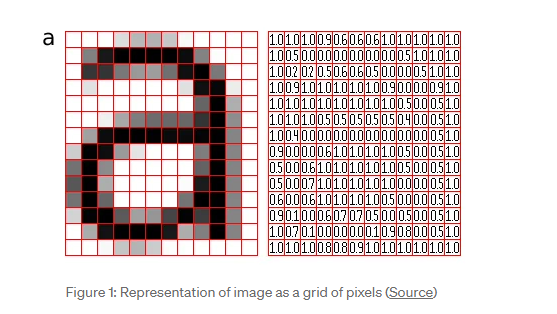
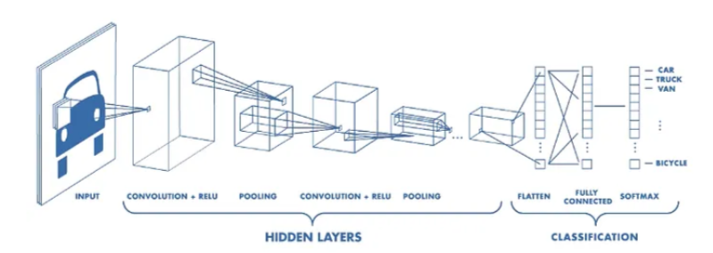
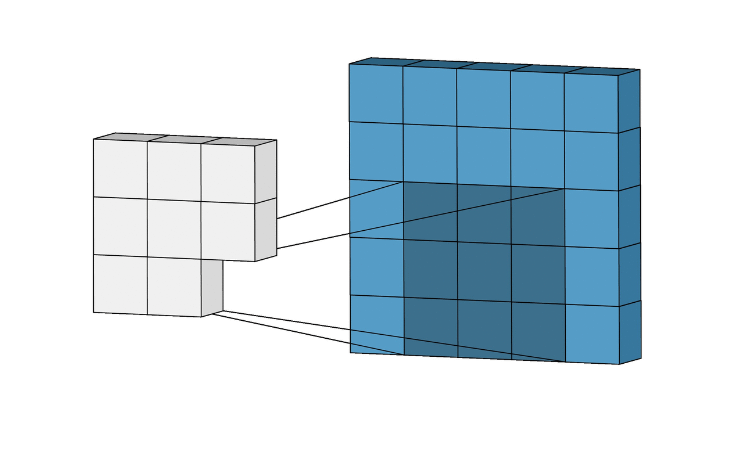
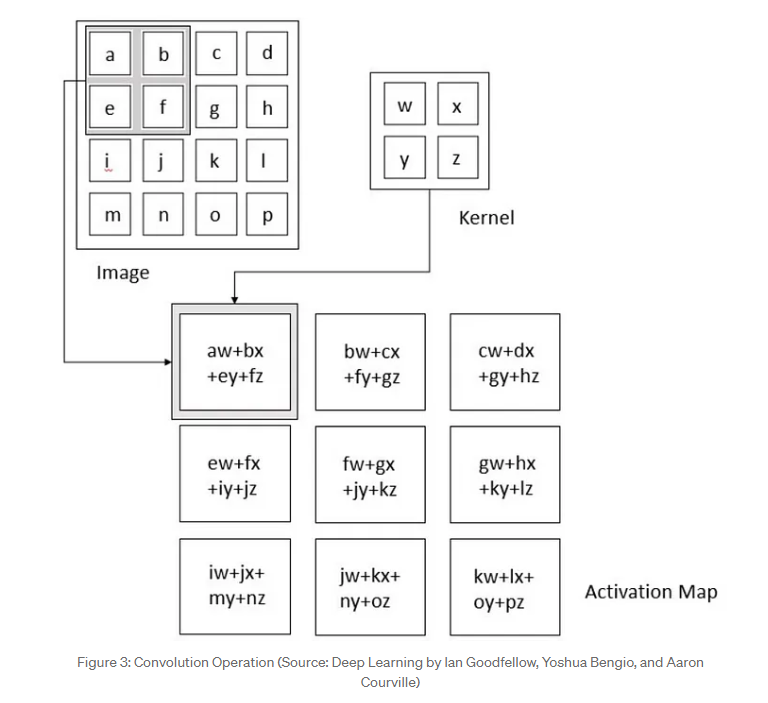

# 卷积

## 什么是卷积

卷积是一种数学运算和信号处理技术，常用于图像处理和神经网络中。在图像处理中，卷积可以应用于图像的滤波、特征提取和边缘检测等任务。在神经网络中，卷积被用于卷积神经网络（Convolutional Neural Networks，CNNs）中的特征提取层。

卷积操作基于一个输入矩阵（如图像）和一个卷积核（也称为滤波器或特征检测器）。卷积核是一个小的矩阵，通过滑动并与输入矩阵的局部区域进行逐元素相乘，然后将所有元素的乘积求和得到输出矩阵的一个元素。这个滑动的过程可以看做是对输入矩阵进行局部感知，从而提取出不同位置的特征。


**卷积操作具有以下特点：**

局部连接：卷积操作仅关注输入矩阵的局部区域，而不考虑整个输入。这使得卷积操作具有一定的平移不变性，即对于输入中相同的特征，它们在不同位置上可以被相同的卷积核检测到。

参数共享：在卷积操作中，同一个卷积核被应用于输入矩阵的不同位置，共享相同的权重参数。这样可以大大减少需要学习的参数数量，提高模型的效率和泛化能力。

卷积在图像处理中的应用包括平滑滤波、边缘检测、图像增强、特征提取等。在神经网络中，卷积层通过多个卷积核对输入数据进行特征提取，从而捕捉图像、语音或其他数据中的局部模式和特征。这使得卷积神经网络能够有效地处理具有空间结构的数据，并在图像识别、语音识别、自然语言处理等任务中取得良好的性能。


## 优缺点


卷积在图像处理和神经网络中具有以下优点和缺点：

优点：

特征提取：卷积操作可以有效地提取输入数据中的局部特征。通过卷积操作，模型可以学习捕捉输入数据中的空间结构和局部模式，从而在图像、语音和其他类型的数据中发现重要的特征。

参数共享：卷积操作中的参数共享使得模型具有较少的可训练参数量。相同的卷积核被应用于输入数据的不同位置，共享相同的权重参数。这减少了需要学习的参数数量，提高了模型的效率和泛化能力。

平移不变性：卷积操作具有一定的平移不变性。对于输入数据中相同的特征，无论其位置如何变化，相同的卷积核仍然可以检测到它们。这使得卷积操作对于处理具有平移性质的数据（如图像）非常有用。

局部连接：卷积操作仅关注输入数据的局部区域，而不考虑整个输入。这使得卷积操作在处理大规模输入数据时可以减少计算量，提高效率。


缺点：

固定感受野大小：卷积操作的感受野大小由卷积核的尺寸确定。这意味着卷积操作对于不同大小的特征需要不同的卷积核，无法自适应地调整感受野大小。

缺乏全局信息：由于卷积操作的局部性质，它无法直接获取输入数据的全局信息。对于某些任务，全局信息可能对结果的判断和预测非常重要。

不适用于非平移不变的数据：卷积操作在处理非平移不变的数据时可能不太适用。对于具有旋转、缩放或变形等变换的数据，卷积操作的效果可能会受到影响。


虽然卷积具有一些缺点，但它在图像处理和神经网络中的广泛应用证明了其在许多任务中的有效性和实用性。此外，研究人员也通过改进卷积结构和引入其他操作来解决一些缺点，以提高模型的性能和扩展性。


## Example

当涉及到图像处理时，一个常见的卷积操作的例子是边缘检测。边缘检测是图像处理中的一项重要任务，用于检测图像中物体边界的位置。

在边缘检测中，常用的卷积核是称为Sobel算子的滤波器。Sobel算子包括两个卷积核，分别用于检测图像中的水平和垂直边缘。

例如，对于灰度图像，可以使用以下两个卷积核进行边缘检测：

水平边缘检测卷积核:

复制
-1  0  1
-2  0  2
-1  0  1
垂直边缘检测卷积核:

复制
-1 -2 -1
 0  0  0
 1  2  1
边缘检测操作通过将这两个卷积核分别应用于图像上的每个像素点，计算相邻像素之间的差异来检测边缘。

这个例子说明了卷积在图像处理中的应用，通过使用不同的卷积核，可以实现不同的图像处理任务，如边缘检测、模糊滤波、锐化等。


卷积操作的计算过程可以通过以下步骤进行：

准备输入矩阵（如图像）和卷积核（滤波器）。输入矩阵是要进行卷积操作的原始数据，而卷积核是一个小的矩阵，用于对输入数据进行局部感知。

将卷积核与输入矩阵的对应区域进行逐元素相乘。将卷积核的每个元素与输入矩阵对应位置的元素相乘。

将相乘得到的结果进行求和。将步骤2中得到的所有元素相加，得到输出矩阵的一个元素。

将卷积核在输入矩阵上移动一定的步幅（stride）。根据设定的步幅，将卷积核在输入矩阵上滑动一定的距离，并重复步骤2和步骤3，计算输出矩阵的其他元素。

重复步骤4，直到卷积核覆盖完整个输入矩阵的所有区域，得到最终的输出矩阵。

在计算卷积操作时，通常还可以应用填充（padding）和步幅（stride）来控制输出矩阵的大小和感受野（receptive field）的大小。填充是在输入矩阵周围添加额外的元素，以保持输出矩阵与输入矩阵的大小一致或控制输出矩阵的尺寸。步幅是卷积核在输入矩阵上移动的步长，它可以控制输出矩阵的分辨率和感受野的大小。

通过不同的卷积核和参数设置，可以实现各种不同的卷积操作，如边缘检测、模糊滤波、特征提取等，以适应不同的图像处理和神经网络任务。


## Towards Data Science

https://towardsdatascience.com/convolutional-neural-networks-explained-9cc5188c4939

A Convolutional Neural Network specializes in processing data that has a grid-like topology, such as an image. A digital image is a binary representation of visual data. It contains a series of pixels arranged in a grid-like fashion that contains pixel values to denote how bright and what color each pixel should be.



The layers are arranged in such a way so that they detect simpler patterns first (lines, curves, etc.) and more complex patterns (faces, objects, etc.) further along. By using a CNN, one can [enable sight to computers](https://www.datascience.com/blog/computer-vision-in-artificial-intelligence).


**A CNN typically has three layers: a convolutional layer, a pooling layer, and a fully connected layer.**



The convolution layer is the core building block of the CNN. It carries the main portion of the network’s computational load.


This layer performs a dot product between two matrices, where one matrix is the set of learnable parameters otherwise known as a kernel, and the other matrix is the restricted portion of the receptive field. The kernel is spatially smaller than an image but is more in-depth. This means that, if the image is composed of three (RGB) channels, the kernel height and width will be spatially small, but the depth extends up to all three channels.




During the forward pass, the kernel slides across the height and width of the image-producing the image representation of that receptive region. This produces a two-dimensional representation of the image known as an activation map that gives the response of the kernel at each spatial position of the image. The sliding size of the kernel is called a stride.


If we have an input of size W x W x D and Dout number of kernels with a spatial size of F with stride S and amount of padding P, then the size of output volume can be determined by the following formula:

这段内容描述的是在卷积神经网络（Convolutional Neural Networks, CNNs）中进行前向传播时卷积层的操作原理以及如何计算经过卷积层处理后输出数据的尺寸。

首先，解释关键词和概念：

- **前向传播（forward pass）**：在神经网络中，数据从输入层通过隐藏层到输出层的过程。在这个过程中，每一层会对数据进行变换。
- **内核/卷积核（kernel）**：在CNN中，卷积核是一个小的权重矩阵，用于通过原始图像提取特征。
- **步幅（stride）**：卷积核在图像上移动的距离。步幅确定了卷积核滑动时每次的位移像素数。


下面解释这段内容：

当进行前向传播时，卷积核会在输入图像的高度和宽度上滑动，处理图像的每一个局部区域。这个局部区域就是卷积核的**感受野（receptive region）**。当卷积核滑过图像的每个位置时，它会产生一个二维的表示，这个表示称为**激活图（activation map）**或特征图，它记录了卷积核在图像每个空间位置的响应。


这段内容还提到了一个计算输出体积尺寸的公式，但没有直接给出公式。然而，根据CNN的操作原理，我们可以推导出这个公式：


假设输入尺寸为 `W x W x D`，其中：

- `W` 是输入的宽度和高度
- `D` 是输入的深度（通道数）

使用 `Dout` 数量的卷积核，每个卷积核的大小为 `F`，步幅为 `S`，填充量为 `P`，输出体积(`Wout x Wout x Dout`)的宽度和高度 `Wout` 可以使用以下公式计算：

```plaintext
Wout = (W - F + 2P) / S + 1
```


在卷积神经网络（CNN）的上下文中，"通道"这个术语通常指的是图像数据的深度维度。这里的"通道"功能描述如下：


在通过CNN的不同层处理后，通道的概念从原始的颜色信息扩展到了特征映射（feature maps）或激活图（activations）：

- 每个卷积层可以有多个卷积核，每个卷积核都能够检测输入数据中的不同特征。因此，每个卷积核产生一个新的二维激活图，该层的所有激活图堆叠在一起形成了一个具有多个通道的输出体积。
- 这些通道不再代表原始的颜色信息，而是代表了图像的高级特征，比如边缘、角点、纹理等。


在CNN中，通道的功能包括：

表示多种特征：不同的通道可以学习图像的不同特征，例如一个通道可能专注于水平边缘，而另一个通道可能专注于纹理。
增加模型的表征能力：多通道允许网络同时学习图像的多种特征表示，从而提高了模型对图像内容的理解。
保持空间和颜色信息：通过在通道维度上保持信息，CNN能够处理空间相邻性和颜色或特征的相关性，这对于理解图像结构至关重要。
总的来说，通道在CNN中是一种机制，允许模型在各个层中维护和处理多维度的特征信息，从而学习到更复杂和抽象的图像表示。




### 解释卷积输出尺寸公式

公式 `Wout = (W - F + 2P) / S + 1` 用于计算卷积神经网络中卷积层的输出宽度和高度。每个变量的含义如下：

- `Wout`：卷积层输出的宽度或高度。
- `W`：输入数据的宽度或高度。
- `F`：卷积核（滤波器）的大小（宽度和高度，假设是正方形）。
- `P`：填充的数量，即在输入数据的周围填充零的层数。这通常用于控制输出的空间尺寸，使其与输入相同或符合特定的设计要求。
- `S`：步幅，决定卷积核在应用卷积操作时滑动的像素数。

公式的计算过程如下：

1. `(W - F)`：从输入宽度中减去卷积核的大小，计算卷积核在没有填充时能够滑动的最后一个位置。如果输入宽度 `W` 是 7，卷积核宽度 `F` 是 3，那么卷积核能够从输入数据的第一个元素（位置 1）开始，到第 `W - F + 1` 个元素（位置 7 - 3 + 1 = 5）结束。这意味着卷积核可以在输入数据上滑动并覆盖从位置 1 到位置 5 的所有区域，而不会超出输入数据的宽度。
2. `+ 2P`：加上两倍的填充数量 （左右各P），这样可以扩展输入数据的有效宽度或高度。
3. `/ S`：将上述结果除以步幅，计算卷积核在整个输入宽度上可以滑动的次数。
4. `+ 1`：由于卷积核的起始位置是从输入的第一个元素开始的，所以最终的滑动次数要加上起始位置。

#### 

在卷积层输出中，通道的概念扩展为特征通道：

- **每个通道是由一个特定的卷积核生成的激活图，代表了输入数据中某种特定的特征或模式。**
- 卷积层可以有多个卷积核，每个卷积核都能够检测输入中的不同特征。因此，每个核生成一个通道，所有这些通道一起构成了卷积层的输出体积。
- 在多层卷积神经网络中，深层的卷积核可能会探测到更加抽象和复杂的特征，如形状、纹理等。

通道允许网络捕获图像多个维度的信息，使得网络能够理解和处理复杂的图像特征。每个通道都可以视为图像不同特征的一个集合，而多通道则允许模型并行地处理多种特征，增强了模型的表达能力。


卷积操作利用了三个促进计算机视觉研究的重要思想：稀疏交互、参数共享和等变表示。让我们详细描述每一个。


**稀疏交互（Sparse Interaction）**

在传统的神经网络层中，通过一个参数矩阵的矩阵乘法来描述输入单元和输出单元之间的交互，这意味着每个输出单元都与每个输入单元交互。然而，卷积神经网络具有稀疏交互。这是通过使卷积核小于输入来实现的。例如，一张图像可能有数百万或数千个像素，但在使用卷积核处理时，我们可以检测到只有几十或几百像素的有意义的信息。这意味着我们需要存储更少的参数，这不仅减少了模型的内存需求，也提高了模型的统计效率。

**参数共享（Parameter Sharing）**

如果在某个空间点 (x1, y1) 计算一个特征是有用的，那么在某个其他空间点 (x2, y2) 也应该是有用的。这意味着对于单个二维切片，即创建一个激活图，神经元被限制使用相同的一组权重。在传统的神经网络中，权重矩阵的每个元素被使用一次然后就不再重访，而卷积网络有共享的参数，也就是说，为了得到输出，应用于一个输入的权重与应用于其他地方的权重相同。

**等变表示（Equivariant Representation）**

由于参数共享，卷积神经网络的层将具有平移等变的属性。这意味着如果我们以某种方式改变输入，输出也会以相同的方式发生改变。简单来说，如果输入图像平移了，卷积网络的输出（激活图）也会相应地平移，这使得模型能够更好地识别平移后的相同特征。
