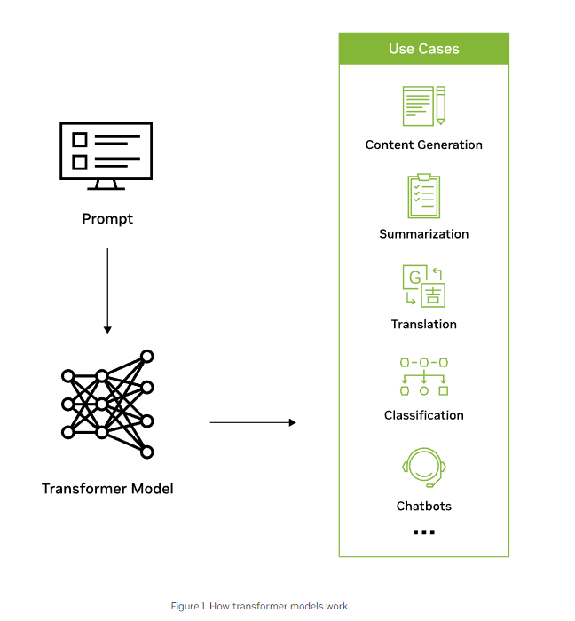
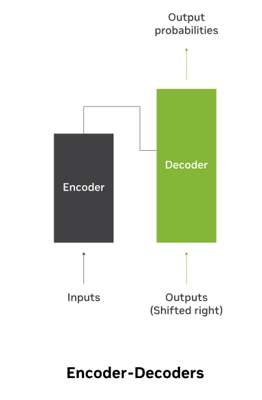

# 什么是大语言模型（elastic）

* https://www.elastic.co/cn/what-is/large-language-models#large-language-model-defintion

**大型语言模型 (LLM) 是一种深度学习算法，可以执行各种**[**自然语言处理 (NLP)**](https://www.elastic.co/cn/what-is/natural-language-processing) **任务。**大型语言模型会使用多个转换器模型，并使用海量数据集进行训练，因此规模非常庞大。这也是它们能够识别、翻译、预测或生成文本或其他内容的强大基础所在。

大型语言模型也称为神经网络 (NN)，是受人类大脑启发而开发出的计算系统。这些神经网络利用分层的节点网络工作，就像神经元一样。

除了向人工智能 (AI) 应用程序教授人类语言外，还可以训练大型语言模型来执行各种任务，如理解蛋白质结构、编写软件代码等。像人类大脑一样，大型语言模型必须经过预先训练，然后再进行微调，这样它们才能解决文本分类、问题解答、文档摘要和文本生成等问题。它们这些解决问题的能力可应用于医疗保健、金融和娱乐等多种领域；在这些领域中，大型语言模型用于支持各种 [NLP 应用程序](https://www.elastic.co/cn/what-is/natural-language-processing)，例如翻译、聊天机器人、AI 助手等。

大型语言模型也具有大量的参数，类似于模型从训练中学习时收集的各种记忆。我们可以将这些参数视为模型的知识库。


**大型语言模型 (LLM) 是一种深度学习算法，可以执行各种**[**自然语言处理 (NLP)**](https://www.elastic.co/cn/what-is/natural-language-processing) **任务。**大型语言模型会使用多个转换器模型，并使用海量数据集进行训练，因此规模非常庞大。这也是它们能够识别、翻译、预测或生成文本或其他内容的强大基础所在。


大型语言模型也称为神经网络 (NN)，是受人类大脑启发而开发出的计算系统。这些神经网络利用分层的节点网络工作，就像神经元一样。


除了向人工智能 (AI) 应用程序教授人类语言外，还可以训练大型语言模型来执行各种任务，如理解蛋白质结构、编写软件代码等。像人类大脑一样，大型语言模型必须经过预先训练，然后再进行微调，这样它们才能解决文本分类、问题解答、文档摘要和文本生成等问题。它们这些解决问题的能力可应用于医疗保健、金融和娱乐等多种领域；在这些领域中，大型语言模型用于支持各种 [NLP 应用程序](https://www.elastic.co/cn/what-is/natural-language-processing)，例如翻译、聊天机器人、AI 助手等。


大型语言模型也具有大量的参数，类似于模型从训练中学习时收集的各种记忆。我们可以将这些参数视为模型的知识库。

* 文本分类：文本分类是将给定的文本分配到预定义的类别或标签中的任务。它可以用于情感分析、垃圾邮件过滤、主题分类等。例如，对于一组电影评论，文本分类模型可以将每个评论标记为“正面”或“负面”。
* 问题解答：问题解答（Question Answering，QA）是一种任务，通过提供问题，模型需要从给定的文本中找到最合适的答案。这可以是从阅读材料中回答问题，或者是通过对已知问题和答案进行训练，以便回答新的问题。通常，QA 模型会从文本中提取相关信息并生成答案。
* 文档摘要：文档摘要是将一篇较长的文档压缩成较短、概括性的摘要的过程。文档摘要可以帮助人们快速了解文档内容，尤其是在需要处理大量信息时。自动文档摘要算法可以通过提取重要句子或生成新的摘要来实现。
* 文本生成：文本生成是指通过机器学习模型生成新的文本，可以是连续的句子、段落或完整的文章。这项任务可以用于生成对话、自动作文、机器翻译等。最近的研究进展中，深度学习模型如 GPT-3 已经显示出在生成自然语言文本方面的强大能力。


## 什么是转换器

**转换器模型**是大型语言模型中最常见的架构。它由一个编码器和一个解码器组成。转换器模型通过将输入信息转换为词元（token）来处理数据，然后同时进行数学运算来发现词元之间的关系。这样，计算机就能够看到人类在面对同样查询时所看到的模式。


转换器模型使用自注意力机制工作，与长短期记忆模型等这类传统模型相比，这种模型的学习速度更快。自注意力让转换器模型能够考虑序列的不同部分或句子的整个上下文，从而生成预测。


## 大语言模型的组件

大型语言模型由多个神经网络层组成。递归层、前馈层、嵌入层和注意力层协同工作，对输入文本进行处理并生成输出内容。

**嵌入层**会基于输入文本创建[嵌入](https://www.elastic.co/cn/what-is/vector-embedding)。大型语言模型的这一部分会获取输入内容的语义和句法含义，从而让模型能够理解上下文。

大型语言模型的**前馈层 (FFN)** 由多个完全互联的层组成，用于转换基于输入文本生成的嵌入。这样，这些层就能够使模型收集更高层级的抽象概念，也就是理解用户输入文本的意图。

**递归层**会按顺序解读输入文本中的字词，并获取句子中字词之间的关系。

**注意力机制**能够让语言模型专注于输入文本中与当前任务相关的各个部分。通过这一层，可让模型生成最准确的输出。


大型语言模型主要有三种：

- **通用或原始语言模型**会根据训练数据中的语言预测下一个字词。这些语言模型可执行信息检索任务。
- **指令调优的语言模型**经过训练后，可预测输入中所给指令的响应。这可使用它们执行[情感分析](https://www.elastic.co/cn/what-is/sentiment-analysis)，或者生成文本或代码。
- **对话调优的语言模型**经过训练后，可通过预测下一个响应来进行对话。例如，聊天机器人或对话 AI。


**大语言模型 VS 生成式AI**

[生成式 AI](https://www.elastic.co/cn/what-is/generative-ai) 是一个总称，是指有能力生成内容的人工智能模型。生成式 AI 可以生成文本、代码、图像、视频和音乐。例如，生成式 AI 有 Midjourney、DALL-E 和 ChatGPT。

大型语言模型是一种生成式 AI，它基于文本进行训练并生成文本内容。ChatGPT 就是一个广为流行的文本生成式 AI 示例。

所有大型语言模型都是生成式 AI1。


## 大语言模型工作原理

大型语言模型以转换器模型(Transformer)为基础，其工作原理是：接收输入，对输入进行编码，然后解码以生成输出预测。但是，在大型语言模型能够接收文本输入并生成输出预测之前，需要先对它进行训练，以便执行一些常规功能，然后再进行微调后才能执行特定任务。


**训练：**大型语言模型会使用维基百科、GitHub 或其他网站的大型文本数据集进行预先训练。这些数据集包含数以万亿计的字词，它们的质量会影响语言模型的性能。在这个阶段，大型语言模型主要进行无监督学习，这意味着它会在没有特定指令的情况下处理输入的数据集。在这个过程中，LLM 的 AI 算法可以学习字词的意思，以及字词之间的关系。此外，它还会根据上下文学习分辨字词。例如，它将学习理解“right”是“正确”的意思，还是“左”的反义词。


**微调：**为了让大型语言模型执行诸如翻译等特定任务，则必须针对特定活动对它进行微调。微调可优化特定任务的性能。

**提示调优**的作用与微调类似，也就是通过少样本提示或零样本提示来训练模型执行特定任务。提示是提供给 LLM 的指令。少样本提示会通过使用示例来教模型预测输出。例如，在这个[情绪分析](https://www.elastic.co/cn/what-is/sentiment-analysis)练习中，少样本提示将如下所示：

```
Customer review: This plant is so beautiful!
Customer sentiment: positive

Customer review: This plant is so hideous!
Customer sentiment: negative
```

**个人觉得提示调优和微调还是很不一样的，提示调优的重点在于提示词，微调仍然是训练的过程。**


## 大语言模型用例

大型语言模型可用于多种用途：

- **信息检索：**例如 Bing 或 Google。每当您使用它们的搜索功能时，都是在依赖于一个大型语言模型根据查询来生成响应信息。它能够检索信息，然后总结并以对话方式交流答案。
- [**情感分析**](https://www.elastic.co/cn/what-is/sentiment-analysis)**：**作为[自然语言处理](https://www.elastic.co/cn/what-is/natural-language-processing)的应用，公司可利用大型语言模型来分析文本数据的情感。
- **文本生成：**大型语言模型是生成式 AI（如 ChatGPT）的基础，可以根据输入信息生成文本。它们可以根据提示生成文本示例。例如：“用 Emily Dickinson 的风格给我写一首关于棕榈树的诗。”
- **代码生成：**与文本生成一样，代码生成也是生成式 AI 的一种应用。LLM 理解这些模式后便可用于生成代码。
- **聊天机器人和对话 AI：**利用大型语言模型，可支持客户服务聊天机器人或对话 AI 与客户进行互动，解读他们的查询或回复的含义，并依次给予响应。


除了上述这些用例之外，大型语言模型还可以补全句子、回答问题和总结文本。

大型语言模型的应用范围如此广泛，在众多领域中都可以找到它的身影：

- **科技业：**从支持搜索引擎响应查询，到协助开发人员编写代码，大型语言模型可应用于任何地方。
- **医疗保健和科学：**大型语言模型能够理解蛋白质、分子、DNA 和 RNA。在这一领域，可利用 LLM 协助疫苗的研制，寻找疾病的治疗方法，以及改进预防保健药物。LLM 还可用作医疗聊天机器人，接收患者入院或进行基本诊断。
- **客户服务：**LLM 可用于支持各行各业的客户服务，如聊天机器人或对话 AI。
- **营销：**市场营销团队可以使用 LLM 来执行[情感分析](https://www.elastic.co/cn/what-is/sentiment-analysis)，以快速生成营销活动创意或文本等，作为推介示例。
- **法律：**从搜索海量文本数据集到生成法律术语，大型语言模型可以为律师、律师助理和法律工作者提供帮助。
- **银行业：**LLM 可以帮助信用卡公司检测欺诈行为。


## 挑战与局限性


大型语言模型给我们留下印象可能是：它们能理解意思，并可准确地做出响应。但是，它们仍然是一种技术工具；因此，大型语言模型也面临着各种各样的挑战。

**幻觉：**幻觉是指 LLM 生成的输出是错误的，或者与用户的意图不符。例如，声称自己是人类，有情感，或是爱上了用户。由于大型语言模型会预测下一个语法正确的字词或短语，因此并不能完全解读人类的意思。这导致有时会产生所谓的“幻觉”。

**安全：**如果管理或监管不当，大型语言模型会带来严重的安全风险。他们可能会泄露人们的私人信息，参与网络钓鱼诈骗，以及产生垃圾邮件。心怀恶意的用户可能会按照自己的意识形态或偏见对 AI 进行重新编程，并助长错误信息的传播。这些不良影响可能会在全球范围内造成毁灭性的后果。

**偏见：**用于训练语言模型的数据会影响给定模型生成的输出。因此，如果数据只代表单一人群，或者缺乏多样性，那么大型语言模型产生的输出也将缺乏多样性。

**同意：**大型语言模型是基于数以万亿计的数据集训练的，其中有些数据集可能不是在双方同意的情况下获得的。众说周知，大型语言模型从互联网上抓取数据时，会忽略版权许可，抄袭书面内容，以及在未获得原所有者或艺术家许可的情况下重新使用专有内容。当它生成结果时，没有办法追踪数据的来源，而且通常不注明创作者，这可能会让用户面临版权侵权问题。

它们还可能会从照片的描述中抓取个人数据，比如拍摄对象的名字或摄影师的名字，这可能会侵犯隐私2。LLM 已经遭到侵犯知识产权方面的诉讼，其中就包括 Getty Images3 的一起著名诉讼。

**扩展：**扩展和维护大型语言模型可能会非常困难，需要耗费大量的时间和资源。

**部署：**部署大型语言模型需要深度学习、转换器模型、分布式软件和硬件，以及全面的技术专业知识。


## 常用大型语言模型示例

很多常用的大型语言模型已经风靡全球。其中有许多已经被各行各业的人们所采用。您一定听说过 ChatGPT 这种[生成式 AI](https://www.elastic.co/cn/what-is/generative-ai) 聊天机器人。

其他常用 LLM 模型还包括：

- **PaLM：**Google 的 Pathways Language Model (PaLM) 是一种转换器语言模型，能够进行常识和算术推理、笑话解释、代码生成和翻译。
- **BERT：**基于转换器的双向编码器表示 (BERT) 语言模型也是在 Google 开发的。它是一个基于转换器的模型，可以理解自然语言并回答问题。
- **XLNet：**XLNet 是一种排列语言模型，以随机顺序生成输出预测，这是它与 BERT 的不同之处。它会先评估编码词元的模式，然后以随机顺序预测词元，而不是按顺序进行预测。
- **GPT：**生成式预训练的转换器可能是最著名的大型语言模型。由 OpenAI 开发的 GPT 是一种热门基础模型，其带编号的迭代都是对前代（GPT-3、GPT-4 等）的改进。它可以进行微调以在下游执行特定任务。这方面的示例包括：Salesforce 开发的用于 CRM 的 EinsteinGPT，以及 Bloomberg 开发的用于金融的 BloombergGPT。


# 什么是大语言模型 (Nvidia)

[Large language models ](https://www.nvidia.com/en-us/deep-learning-ai/solutions/large-language-models/)largely represent a class of deep learning architectures called [transformer networks](https://blogs.nvidia.com/blog/2022/03/25/what-is-a-transformer-model/). A transformer model is a neural network that learns context and meaning by tracking relationships in sequential data, like the words in this sentence.


A transformer is made up of multiple transformer blocks, also known as layers. For example, a transformer has self-attention layers, feed-forward layers, and normalization layers, all working together to decipher input to predict streams of output at inference. The layers can be stacked to make deeper transformers and powerful language models. Transformers were first introduced by Google in the 2017 paper [“Attention Is All You Need.”](https://arxiv.org/abs/1706.03762)

 




There are two key innovations that make transformers particularly adept for large language models: positional encodings and self-attention. 

* Positional encoding embeds the order of which the input occurs within a given sequence. Essentially, instead of feeding words within a sentence sequentially into the neural network, thanks to positional encoding, the words can be fed in non-sequentially.

* Self-attention assigns a weight to each part of the input data while processing it. This weight signifies the importance of that input in context to the rest of the input. In other words, models no longer have to dedicate the same attention to all inputs and can focus on the parts of the input that actually matter. This representation of what parts of the input the neural network needs to pay attention to is learnt over time as the model sifts and analyzes mountains of data.

These two techniques in conjunction allow for analyzing the subtle ways and contexts in which distinct elements influence and relate to each other over long distances, non-sequentially. 

The ability to process data non-sequentially enables the decomposition of the complex problem into multiple, smaller, simultaneous computations. Naturally, GPUs are well suited to solve these types of problems in parallel, allowing for large-scale processing of large-scale unlabelled datasets and enormous transformer networks.


##  Why are Large Language Models Important?

Historically, AI models had been focused on perception and understanding. 

However, large language models, which are trained on internet-scale datasets with hundreds of billions of parameters, have now unlocked an AI model’s ability to generate human-like content.

Models can read, write, code, draw, and create in a credible fashion and augment human creativity and improve productivity across industries to solve the world’s toughest problems. 

The applications for these LLMs span across a plethora of use cases. For example, an AI system can learn the language of protein sequences to provide viable compounds that will help scientists develop groundbreaking, life-saving vaccines. 

Or computers can help humans do what they do best—be creative, communicate, and create. A writer suffering from writer’s block can use a large language model to help spark their creativity. 

Or a software programmer can be more productive, leveraging LLMs to generate code based on natural language descriptions. 


## What are Large Language Model examples?

Advancements across the entire compute stack have allowed for the development of increasingly sophisticated LLMs. In June 2020, OpenAI released [GPT-3](https://arxiv.org/abs/2005.14165), a 175 billion-parameter model that generated text and code with short written prompts. [In 2021, NVIDIA and Microsoft developed Megatron-Turing Natural Language Generation 530B](https://developer.nvidia.com/blog/using-deepspeed-and-megatron-to-train-megatron-turing-nlg-530b-the-worlds-largest-and-most-powerful-generative-language-model/), one of the world’s largest models for reading comprehension and natural language inference, with 530 billion parameters. 

As LLMs have grown in size, so have their capabilities. Broadly, LLM use cases for text-based content can be divided up in the following manner: 

1. Generation (e.g., story writing, marketing content creation)
2. Summarization (e.g., legal paraphrasing, meeting notes summarization)
3. Translation (e.g., between languages, text-to-code)
4. Classification (e.g., toxicity classification, sentiment analysis)
5. Chatbot (e.g., open-domain Q+A, virtual assistants)

Enterprises across the world are starting to leverage LLMs to unlock new possibilities: 

- [Medical researchers](https://blogs.nvidia.com/blog/2022/09/20/bionemo-large-language-models-drug-discovery/) train [large language models in healthcare](https://developer.nvidia.com/blog/building-generative-ai-pipelines-for-drug-discovery-with-bionemo-service/) on a corpus of data from textbooks, research papers and patient electronic health records for tasks like [protein structure prediction](https://developer.nvidia.com/blog/predict-protein-structures-and-properties-with-biomolecular-large-language-models-2/) that can uncover patterns in disease and predict outcomes.
- Retailers can leverage LLMs to provide stellar customer experiences to customers through dynamic chatbots. 
- Developers can leverage [LLMs to write software](https://www.tabnine.com/) and [teach robots how to do physical tasks](https://www.deepmind.com/publications/a-generalist-agent).
- Financial advisors can use LLMs to summarize earnings calls and create transcripts of important meetings. 
- Marketers can train an LLM to [organize customer feedback and requests into clusters or segment products into categories based on product descriptions. ](https://www.businesswire.com/news/home/20220223005437/en/New-GPT-AI-Powered-Large-Language-Model-for-Banking-Increases-Financial-Services-Institutions-Competitiveness-and-Enables-Accelerated-Digital-Transformation-in-Weeks-Not-Years)

Large language models are still in their early days, and their promise is enormous; a single model with zero-shot learning capabilities can solve nearly every imaginable problem by understanding and generating human-like thoughts instantaneously. The use cases span across every company, every business transaction, and every industry, allowing for immense value-creation opportunities. 


## How Do Large Language Models Work?

Large language models are trained using [unsupervised learning](https://blogs.nvidia.com/blog/2018/08/02/supervised-unsupervised-learning/). With unsupervised learning, models can find previously unknown patterns in data using unlabelled datasets. This also eliminates the need for extensive data labeling, which is one of the biggest challenges in building AI models.

Thanks to the extensive training process that LLMs undergo, the models don’t need to be trained for any specific task and can instead serve multiple use cases. These types of models are known as foundation models. 

The ability for the foundation model to generate text for a wide variety of purposes without much instruction or training is called zero-shot learning. Different variations of this capability include one-shot or few-shot learning, wherein the foundation model is fed one or a few examples illustrating how a task can be accomplished to understand and better perform on select use cases.

Despite the tremendous capabilities of zero-shot learning with large language models, developers and enterprises have an innate desire to tame these systems to behave in their desired manner. To deploy these large language models for specific use cases, the models can be customized using several techniques to achieve higher accuracy. Some techniques include [prompt tuning](https://developer.nvidia.com/blog/adapting-p-tuning-to-solve-non-english-downstream-tasks/), fine-tuning, and [adapters](https://docs.nvidia.com/deeplearning/nemo/user-guide/docs/en/v1.10.0/core/adapters/intro.html). 




There are several classes of large language models that are suited for different types of use cases:

- **Encoder only**: These models are typically suited for tasks that can understand language, such as classification and sentiment analysis. Examples of encoder-only models include BERT (Bidirectional Encoder Representations from Transformers).
- **Decoder only**: This class of models is extremely good at generating language and content. Some use cases include story writing and blog generation. Examples of decoder-only architectures include GPT-3 (Generative Pretrained Transformer 3).
- **Encoder-decoder**: These models combine the encoder and decoder components of the transformer architecture to both understand and generate content. Some use cases where this architecture shines include translation and summarization. Examples of encoder-decoder architectures include T5 (Text-to-Text Transformer).


## What are the Challenges of Large Language Models?

The significant capital investment, large datasets, technical expertise, and large-scale compute infrastructure necessary to develop and maintain large language models have been a barrier to entry for most enterprises.


1. **Compute-, cost-, and time-intensive workload**: Significant capital investment, technical expertise, and large-scale compute infrastructure are necessary to maintain and develop LLMs. Training an LLM requires thousands of GPUs and weeks to months of dedicated training time. Some estimates indicate that a single training run for a GPT-3 model with 175 billion parameters, trained on 300 billion tokens, may [cost over $12 million dollars in just compute](https://direct.mit.edu/tacl/article/doi/10.1162/tacl_a_00413/107387/Compressing-Large-Scale-Transformer-Based-Models-A). 
2. **Scale of data required**: As mentioned, training a large model requires a significant amount of data. Many companies struggle to get access to large enough datasets to train their large language models. This issue is compounded for use cases that require private—such as financial or health—data. In fact, it’s possible that the data required to train the model doesn’t even exist.
3. **Technical expertise**: Due to their scale, training and deploying large language models are very difficult and require a strong understanding of deep learning workflows, transformers, and distributed software and hardware, as well as the ability to manage thousands of GPUs simultaneously.


